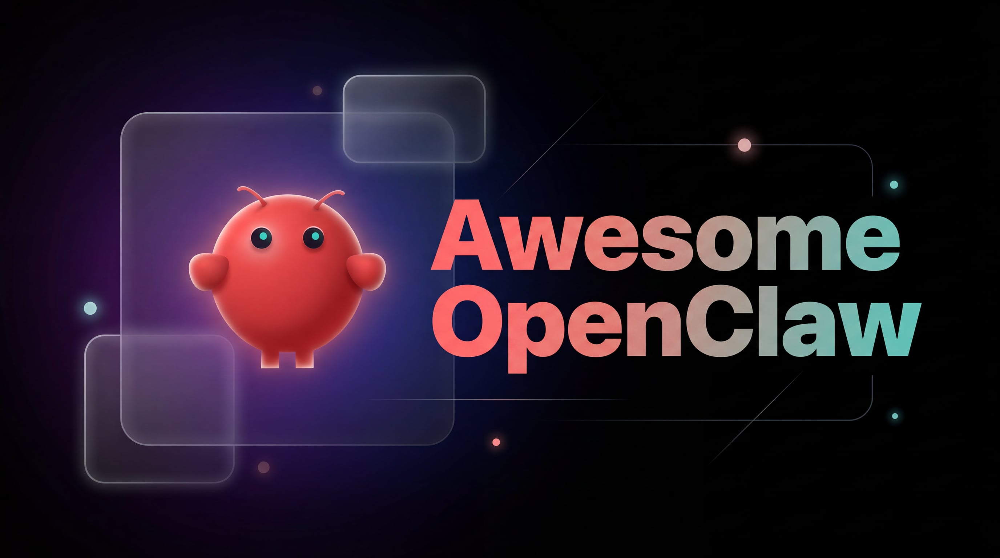

<div align="center">



# Awesome OpenClaw

[](https://github.com/sindresorhus/awesome)
[](https://github.com/geekjourneyx/awesome-openclaw)
[](LICENSE)

[**English**](README.md) | [**简体中文**](README_zh.md)

---

**A curated collection of OpenClaw resources, guides, and best practices.**

[OpenClaw](https://openclaw.ai/) is a self-hosted gateway that connects your favorite chat apps to AI agents.

[Overview](#overview) • [Installation](#installation) • [Channels](#channels) • [Tools](#tools) • [Providers](#providers) • [Guides](#guides) • [Resources](#resources)

</div>

---

## Table of Contents

- [Overview](#overview)
- [Installation](#installation)
- [Configuration](#configuration)
- [Channels](#channels)
- [Tools](#tools)
- [Model Providers](#model-providers)
- [Guides](#guides)
- [Official Resources](#official-resources)
- [Community](#community)
- [License](#license)

---

## Overview

> **"EXFOLIATE! EXFOLIATE!"** — A space lobster, probably

OpenClaw is a **self-hosted gateway** that connects your favorite chat apps — WhatsApp, Telegram, Discord, iMessage, and more — to AI agents. You run a single Gateway process on your own machine (or a server), and it becomes the bridge between your messaging apps and an always-available AI assistant.

### Key Features

| Feature | Description |
|---------|-------------|
| **Self-hosted** | Runs on your hardware, your rules, your data |
| **Multi-channel** | One Gateway serves WhatsApp, Telegram, Discord, and more |
| **Agent-native** | Built for coding agents with tool use, sessions, and memory |
| **Open source** | MIT licensed, community-driven |
| **First-class tools** | Browser, canvas, nodes, cron, web search, and more |

### System Requirements

- **Node.js 22+** (the installer script will install it if missing)
- **OS**: macOS, Linux, or Windows (WSL2 recommended for Windows)
- **API Key**: Anthropic Claude or another supported provider

---

## Installation

### Quick Install (Recommended)

The installer script handles Node detection, installation, and onboarding in one step.

**macOS / Linux / WSL2:**

```bash
curl -fsSL https://openclaw.ai/install.sh | bash
```

**Windows (PowerShell):**

```powershell
iwr -useb https://openclaw.ai/install.ps1 | iex
```

### Alternative Installation Methods

**npm / pnpm:**

```bash
npm install -g openclaw@latest
openclaw onboard --install-daemon
```

**Docker:**

See [Docker Installation](https://docs.openclaw.ai/install#docker) in the official docs.

**From Source:**

```bash
git clone https://github.com/openclaw/openclaw.git
cd openclaw
pnpm install
pnpm ui:build
pnpm build
pnpm link --global
openclaw onboard --install-daemon
```

### Verify Installation

```bash
openclaw doctor    # Check for config issues
openclaw status    # Gateway status
openclaw dashboard # Open the browser UI
```

---

## Configuration

Configuration lives at `~/.openclaw/openclaw.json`.

### Minimal Configuration

If you do nothing, OpenClaw uses sensible defaults. Here is a minimal example:

```json
{
  "agents": {
    "defaults": {
      "model": {
        "primary": "anthropic/claude-opus-4-6"
      }
    }
  }
}
```

### Access Control Example

```json
{
  "channels": {
    "whatsapp": {
      "allowFrom": ["+15555550123"],
      "groups": {
        "*": { "requireMention": true }
      }
    }
  },
  "messages": {
    "groupChat": {
      "mentionPatterns": ["@openclaw"]
    }
  }
}
```

For complete configuration options, see the [official documentation](https://docs.openclaw.ai/).

---

## Channels

OpenClaw supports multiple messaging platforms through a single Gateway:

| Channel | Description | Documentation |
|---------|-------------|---------------|
| **WhatsApp** | Most popular option | [WhatsApp Setup](https://docs.openclaw.ai/channels/whatsapp) |
| **Telegram** | Full feature support | [Telegram Setup](https://docs.openclaw.ai/channels/telegram) |
| **Discord** | Slash commands supported | [Discord Setup](https://docs.openclaw.ai/channels/discord) |
| **Slack** | Enterprise ready | [Slack Setup](https://docs.openclaw.ai/channels/slack) |
| **Signal** | Privacy-focused | [Signal Setup](https://docs.openclaw.ai/channels/signal) |
| **iMessage** | macOS only | [iMessage Setup](https://docs.openclaw.ai/channels/imessage) |
| **WebChat** | Built-in web UI | [WebChat Setup](https://docs.openclaw.ai/channels/webchat) |

See all [supported channels](https://docs.openclaw.ai/channels).

---

## Tools

OpenClaw exposes **first-class agent tools** for browser, canvas, nodes, and cron:

| Tool | Description | Documentation |
|------|-------------|---------------|
| **browser** | Control dedicated browser instance | [Browser Tool](https://docs.openclaw.ai/tools#browser) |
| **canvas** | Drive the node Canvas (A2UI) | [Canvas Tool](https://docs.openclaw.ai/tools#canvas) |
| **nodes** | Discover and target paired nodes | [Nodes Tool](https://docs.openclaw.ai/tools#nodes) |
| **cron** | Manage Gateway cron jobs and wakeups | [Cron Tool](https://docs.openclaw.ai/tools#cron) |
| **exec** | Run shell commands in workspace | [Exec Tool](https://docs.openclaw.ai/tools#exec) |
| **web_search** | Search the web using Brave Search API | [Web Search](https://docs.openclaw.ai/tools#web_search) |
| **web_fetch** | Fetch and extract readable content from URLs | [Web Fetch](https://docs.openclaw.ai/tools#web_fetch) |
| **message** | Send messages across channels | [Message Tool](https://docs.openclaw.ai/tools#message) |
| **sessions** | List, inspect, and send to sessions | [Sessions Tool](https://docs.openclaw.ai/tools#sessions_list) |

See [complete tools documentation](https://docs.openclaw.ai/tools).

### Tool Profiles

Pre-configured tool allowlists for different use cases:

| Profile | Tools Included | Best For |
|---------|----------------|----------|
| `minimal` | session_status only | Restricted environments |
| `coding` | fs, runtime, sessions, memory, image | Development work |
| `messaging` | messaging, sessions operations | Chat-focused agents |
| `full` | No restrictions (default) | Full agent capabilities |

---

## Model Providers

OpenClaw supports multiple LLM providers. Authenticate with a provider, then set the default model.

### Supported Providers

| Provider | Models | Status |
|----------|--------|--------|
| **Anthropic** | Claude Opus 4.6, Sonnet, Haiku | Native Support |
| **OpenAI** | GPT-4.1, GPT-4o, GPT-3.5 | Native Support |
| **Google** | Gemini 2.5 Pro/Ultra | Native Support |
| **Venice AI** | Llama 3.3, Claude Opus | Recommended for privacy |
| **Qwen** | Qwen models | OAuth support |
| **OpenRouter** | 100+ models via API | Supported |
| **Vercel AI Gateway** | Multiple models | Supported |
| **Cloudflare AI Gateway** | Multiple models | Supported |
| **Ollama** | Local models | Supported |

See all [providers documentation](https://docs.openclaw.ai/providers).

### Model Configuration

```json
{
  "agents": {
    "defaults": {
      "model": {
        "primary": "anthropic/claude-opus-4-6"
      }
    }
  }
}
```

---

## Guides

### Practical Guides

| Guide | Description |
|-------|-------------|
| [Web Tools Complete Guide](docs/web-tools-guide.md) | Web search and fetch configuration |
| [Browser Tool Complete Guide](docs/browser-guide.md) | Browser automation and control |

### Official Guides

| Guide | Description | Link |
|-------|-------------|------|
| **Getting Started** | Quick start guide | [docs.openclaw.ai](https://docs.openclaw.ai/) |
| **Architecture** | Gateway, clients, nodes overview | [Architecture](https://docs.openclaw.ai/concepts/architecture) |
| **Installation** | Detailed install instructions | [Install](https://docs.openclaw.ai/install) |
| **Platforms** | Platform-specific setup | [Platforms](https://docs.openclaw.ai/platforms) |
| **Gateway & Ops** | Gateway operations | [Gateway](https://docs.openclaw.ai/gateway) |
| **CLI Reference** | Command-line interface | [CLI](https://docs.openclaw.ai/cli) |
| **Help** | General help | [Help](https://docs.openclaw.ai/help) |

---

## Official Resources

| Resource | URL | Description |
|----------|-----|-------------|
| **Official Site** | https://openclaw.ai/ | Main website |
| **Documentation** | https://docs.openclaw.ai/ | Official docs |
| **GitHub** | https://github.com/openclaw/openclaw | Source code |
| **ClawHub** | https://clawhub.ai/ | Skill registry |
| **Skill Directory** | https://github.com/openclaw/clawhub | Skill repository |
| **Awesome Skills** | https://github.com/VoltAgent/awesome-openclaw-skills | Community skills |
| **Discord** | https://discord.gg/openclaw | Community chat |

---

## Community

- **Discord**: [Join the OpenClaw Discord](https://discord.gg/openclaw)
- **GitHub**: [OpenClaw Repository](https://github.com/openclaw/openclaw)
- **ClawHub**: [Find and share skills](https://clawhub.ai/)

---

## License

This repository is licensed under the [MIT License](LICENSE).

OpenClaw itself is released under the Apache 2.0 License.

---

## Author

- **Author**: geekjourneyx
- **X (Twitter)**: https://x.com/seekjourney
- **WeChat Official Account**: 极客杰尼

<p align="center">

</p>

---

<div align="center">

**Made with heart for OpenClaw**

[Back to Top](#awesome-openclaw)

</div>
